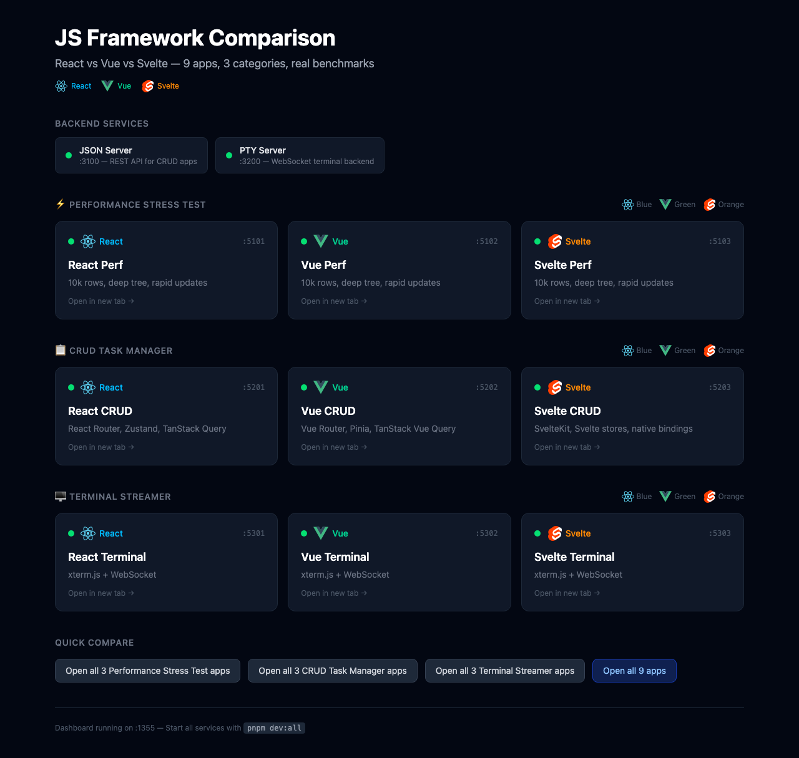

# React vs Vue vs Svelte — Real-World Comparison

Side-by-side comparison of React, Vue, and Svelte using identical apps. Not synthetic benchmarks or hello worlds — actual apps you'd build at work.



## What's Inside

### 3 App Types × 3 Frameworks = 9 Apps

| App | What it does | What it tests |
|-----|-------------|---------------|
| **Performance Stress Test** | 10k row table, deep component tree, rapid state updates | Raw rendering speed, reactivity, memory usage |
| **CRUD Task Manager** | Full task manager with filters, search, pagination, forms | Real-world DX, ecosystem packages, code volume |
| **Terminal Streamer** | Web terminal connected to a real shell via WebSocket | High-frequency DOM updates, streaming data, lifecycle management |

### Ecosystem Used

| | React | Vue | Svelte |
|---|---|---|---|
| **Routing** | React Router v7 | Vue Router | SvelteKit |
| **State** | Zustand | Pinia | Svelte stores |
| **Server State** | TanStack Query | TanStack Vue Query | fetch + load functions |
| **Forms** | React Hook Form + Zod | VeeValidate + Zod | Native bindings + Zod |
| **Terminal** | xterm.js | xterm.js | xterm.js |
| **Styling** | Tailwind v4 | Tailwind v4 | Tailwind v4 |

## Benchmark Results

Measured with Playwright headless Chromium. Median of 3 runs. All three apps render the same UI with the same data.

### Rendering Performance (ms, lower is better)

| Benchmark | React | Vue | Svelte |
|---|--:|--:|--:|
| Create 10,000 rows | 831.5 | **272.6** | 468.4 |
| Update every 10th row | 254.3 | 51.5 | **33.0** |
| Swap rows | 198.7 | 47.5 | **45.6** |
| Select row | 256.0 | 28.4 | **15.4** |
| Append 1,000 rows | 210.5 | **69.8** | 97.2 |
| Clear all | 46.6 | 31.6 | **29.1** |

### Bundle Size (JS gzipped)

| App | React | Vue | Svelte |
|---|--:|--:|--:|
| Perf Stress Test | 62.4 KB | 28.1 KB | **18.0 KB** |
| Terminal Streamer | 135.3 KB | 99.6 KB | **87.4 KB** |

### What the numbers say

- **Svelte is fastest for targeted updates** — selecting a row takes 15ms vs React's 256ms. No virtual DOM diffing means surgical DOM updates.
- **Vue wins initial bulk render** — 10k rows in 273ms, beating both Svelte (468ms) and React (832ms). Its template compiler + proxy reactivity handles mass creation well.
- **React has the most overhead** — 3-16x slower than Vue/Svelte on partial updates. The VDOM diffing cost scales with list size.
- **Svelte ships the least code** — 18KB gzipped vs React's 62KB for the same app. 3.5x smaller.

> Numbers will vary by machine. Run `pnpm dev:all` and test yourself.

## Quick Start

```bash
pnpm install
pnpm dev:all
```

Open **http://localhost:1355** — dashboard with links to all 9 apps.

## Running Individual Apps

```bash
# Backends (needed for CRUD and Terminal apps)
pnpm dev:server:json    # REST API on :3100
pnpm dev:server:pty     # WebSocket terminal on :3200

# Performance
pnpm dev:perf:react     # :5101
pnpm dev:perf:vue       # :5102
pnpm dev:perf:svelte    # :5103

# CRUD
pnpm dev:crud:react     # :5201
pnpm dev:crud:vue       # :5202
pnpm dev:crud:svelte    # :5203

# Terminal
pnpm dev:xterm:react    # :5301
pnpm dev:xterm:vue      # :5302
pnpm dev:xterm:svelte   # :5303
```

## Running Benchmarks

```bash
pnpm bench                                          # all benchmarks
pnpm bench -- --app perf-stress --framework react   # specific app/framework
pnpm bench -- --runs 10                             # more iterations
```

Results are written to `results/comparison.md`.

## Running Tests

```bash
pnpm e2e        # 32 Playwright E2E tests across all apps
```

## Project Structure

```
├── dashboard/           # Index page on :1355
├── apps/
│   ├── perf-stress/     # react/ vue/ svelte/
│   ├── crud/            # react/ vue/ svelte/
│   └── xterm/           # react/ vue/ svelte/
├── server/
│   ├── json/            # json-server for CRUD apps
│   └── pty/             # node-pty + WebSocket for terminal apps
├── bench/               # Playwright-based benchmark runner
├── shared/              # Types, benchmark utilities
└── e2e/                 # E2E smoke tests
```

## Tech Stack

- **Build**: Vite 6, pnpm workspaces
- **React** 19, **Vue** 3.5, **Svelte** 5 (runes)
- **Tailwind CSS** v4
- **TypeScript** throughout
- **Playwright** for benchmarks and E2E tests

## License

MIT
